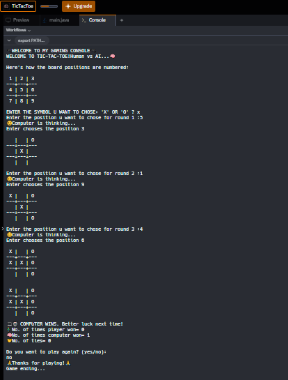

# 🎮 Tic-Tac-Toe (Human vs AI) 🧠
Welcome to my custom Tic-Tac-Toe game, where you take on an unbeatable AI that plays with advanced strategies — threat blocking, fork prevention, and smart corner prioritization.

# 🚀 Features
🎭 Human vs AI gameplay

🧠 AI with early move strategies

🛡️ Threat detection + fork prevention

🎨 Colorful console messages & emojis 

✅ Unbeatable logic — good luck winning!

# 🛠️ How to Run

Open the project on Replit
Click ▶️ Run and play in the console.

Choose your symbol (❌ or ⭕).
The position guide (1–9) will help you choose where to play.
The AI will respond with strategic counter moves.
First to align 3 in a row (horizontal, vertical, diagonal) wins!

# 📂 Direct Link to Code
[👉 View the TicTacToe Code](./Tic-Tac-Toe.java)

# Sample

# 📜 License
This project is licensed under the [MIT License](./LICENSE).

# 🤝 Contributing
Contributions are welcome! Feel free to fork this repo and create a pull request.

# 👩‍💻 Made By
- **Sree Bhattacharya**  
  🎮 Passionate about coding, games, and AI logic.  
  🌟 Follow me on GitHub for more projects!

# ⭐ Support
If you like this project, give it a star ⭐ on GitHub — it really motivates me to keep building!

